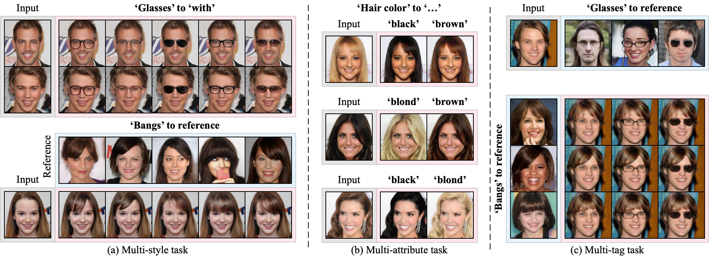
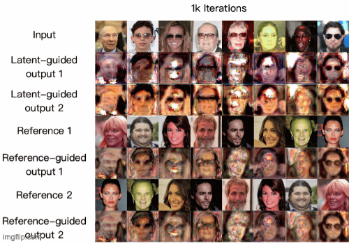

[](LICENSE.md)

# HiSD: Image-to-image Translation via Hierarchical Style Disentanglement

Official pytorch implementation of paper "[Image-to-image Translation via Hierarchical Style Disentanglement](https://arxiv.org/abs/2103.01456)".



HiSD is the SOTA image-to-image translation method for both ****Scalability**** for multiple labels and ****Controllable Diversity**** with impressive disentanglement.

The styles to manipolate each tag in our method can be not only generated by random noise but also extracted from images!

Also, the styles can be smoothly interpolated like:


All tranlsations are producted be a unified HiSD model and trained end-to-end.

**!News:**

**[2021.3.11]: High-resolution (256x256) config and checkpoint released.**

## Easy Use (for Both Jupyter Notebook and Python Script)

Download the pretrained checkpoint in [Baidu Drive](https://pan.baidu.com/s/1QfZ4CzXH7A7MA0MSqN1ssg) (Password:wgdx) or [Google Drive](https://drive.google.com/file/d/1KDrNWLejpo02fcalUOrAJOl1hGoccBKl/view?usp=sharing). Then put it into the root of this repo.

Open "easy_use.ipynb" and you can manipolate the facial attributes by yourself!

If you haven't installed Jupyter, use "easy_use.py". 

The script will translate "examples/input_0.jpg" to be with bangs generated by a random noise and glasses extracted from "examples/reference_glasses_0.jpg"

## Quick Start

### Clone this repo:

```
git clone https://github.com/imlixinyang/HiSD.git
cd HiSD/
```

### Install the dependencies: (Anaconda is recommended.)
```
conda create -n HiSD python=3.6.6
conda activate HiSD
conda install -y pytorch=1.0.1 torchvision=0.2.2  cudatoolkit=10.1 -c pytorch
pip install pillow tqdm tensorboardx pyyaml
```

### Download the dataset.

We recommend you to download CelebA-HQ from [CelebAMask-HQ](https://github.com/switchablenorms/CelebAMask-HQ).
Anyway you shound get the dataset folder like:
```
celeba_or_celebahq
 - img_dir
   - img0
   - img1
   - ...
 - train_label.txt
```

### Preprocess the dataset.

In our paper, we use fisrt 3000 as test set and remaining 27000 for training.
Carefully check the fisrt few (always two) lines in the label file which is not like the others.
```
python proprecessors/celeba-hq.py --img_path $your_image_path --label_path $your_label_path --target_path datasets --start 3002 --end 30002
```
Then you will get several ".txt" files in the "datasets/", each of them consists of lines of the absolute path of image and its tag-irrelevant conditions (Age and Gender by default).

Allmost all custom datasets can be converted into special cases of HiSD.
We provide a script for custom datasets.
You need to organize the folder like:
```
your_training_set
 - Tag0
   - attribute0
     - img0
     - img1
     - ...
   - attribute1
     - ...
 - Tag1
 - ...
```
For example, the AFHQ (one tag and three attributes, remember to split the training and test set first):
```
AFHQ_training
  - Category
    - cat
      - img0
      - img1
      - ...
    - dog
      - ...
    - wild
      - ...
```

You can Run
```
python preprocessors/custom.py --imgs $your_training_set --target_path datasets/custom.txt
```
For other datasets, please code the preprocessor by yourself.

Here, we provide some links for you to download other available datasets:
- Face
  - **[CelebA](http://mmlab.ie.cuhk.edu.hk/projects/CelebA.html)**
  - **[FFHQ-aging](https://github.com/VEDANTGHODKE/FFHQ-Ageing-Dataset)**
  - **[RaFD](http://www.socsci.ru.nl:8180/RaFD2/RaFD?p=main)**
- Animals
  - **AFHQ** (from [StarGANv2](https://github.com/clovaai/stargan-v2))
  - cat2dog (from [DRIT](https://github.com/HsinYingLee/DRIT))
- Others
  - horse2zebra, orange2apple, summer2winter, monet2photos (from [CycleGAN and Pix2Pix](https://github.com/junyanz/pytorch-CycleGAN-and-pix2pix))
  - Selfie2Waifu (from [UGATIT](https://github.com/znxlwm/UGATIT-pytorch))
  - Makeup (from [BeautyGAN](http://liusi-group.com/projects/BeautyGAN))

Dataset in **Bold** means we have tested the generalization of HiSD for this dataset.

### Train.
Following "configs/celeba-hq.yaml" to make the config file fit your machine and dataset.

For a single 1080Ti and CelebA-HQ, you can directly run:
```
python core/train.py --config configs/celeba-hq.yaml --gpus 0
```

The samples and checkpoints are in the "outputs/" dir.
For Celeba-hq dataset, the samples during first 200k iterations will be like: (tag 'Glasses' to attribute 'with')



### Test.

Modify the 'steps' dict in the first few lines in 'core/test.py' and run:
```
python core/test.py --config configs/celeba-hq.yaml --checkpoint $your_checkpoint --input_path $your_input_path --output_path results
```
$your_input_path can be either a image file or a folder of images.
Default 'steps' make every image to be with bangs and glasses using random latent-guided styles.

### Evaluation metrics.

We use [FID](https://github.com/clovaai/stargan-v2/blob/master/metrics/fid.py) of StarGANv2 for quantitative comparison. For more details, please refer to the paper.

## License

Licensed under the CC BY-NC-SA 4.0 (Attribution-NonCommercial-ShareAlike 4.0 International)

The code is released for academic research use only. For other use, please contact me at [imlixinyang@gmail.com](mailto:imlixinyang@gmail.com).
 
## Citation

If our paper helps your research, please cite it in your publications:
```
@InProceedings{Li_2021_CVPR,
    author    = {Li, Xinyang and Zhang, Shengchuan and Hu, Jie and Cao, Liujuan and Hong, Xiaopeng and Mao, Xudong and Huang, Feiyue and Wu, Yongjian and Ji, Rongrong},
    title     = {Image-to-Image Translation via Hierarchical Style Disentanglement},
    booktitle = {Proceedings of the IEEE/CVF Conference on Computer Vision and Pattern Recognition (CVPR)},
    month     = {June},
    year      = {2021},
    pages     = {8639-8648}
}
```

I try my best to make the code easy to understand or further modified because I feel very lucky to start with the clear and readily comprehensible code of [MUNIT](https://github.com/NVlabs/MUNIT) when I'm a beginner.

If you have any problem, please feel free to contact me at [imlixinyang@gmail.com](mailto:imlixinyang@gmail.com) or raise an issue.

## Related Work

- Multi-style/modal: [MUNIT](https://github.com/NVlabs/MUNIT), [DRIT](https://github.com/HsinYingLee/DRIT), [ContentDisentanglement](https://github.com/oripress/ContentDisentanglement), etc.
- Multi-label: [StarGAN](https://github.com/yunjey/stargan), [STGAN](https://github.com/csmliu/STGAN), [RelGAN](https://github.com/elvisyjlin/RelGAN-PyTorch), etc.
- Joint: [SMIT](https://github.com/BCV-Uniandes/SMIT), [SDIT](https://github.com/yaxingwang/SDIT), [DMIT](https://github.com/Xiaoming-Yu/DMIT), [AGUIT](https://github.com/imlixinyang/AGUIT), [ELEGANT](https://github.com/Prinsphield/ELEGANT), [StarGANv2](https://github.com/clovaai/stargan-v2), etc.

